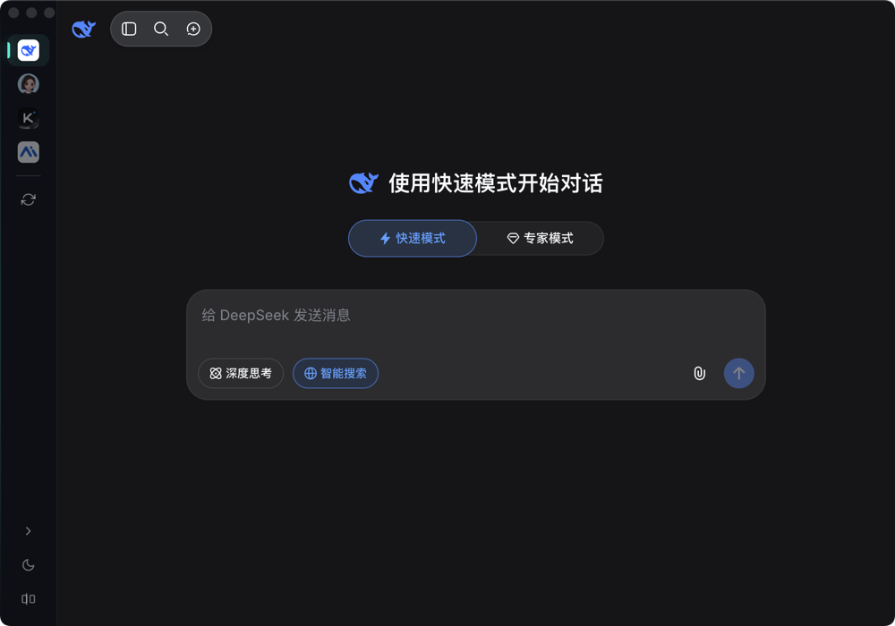
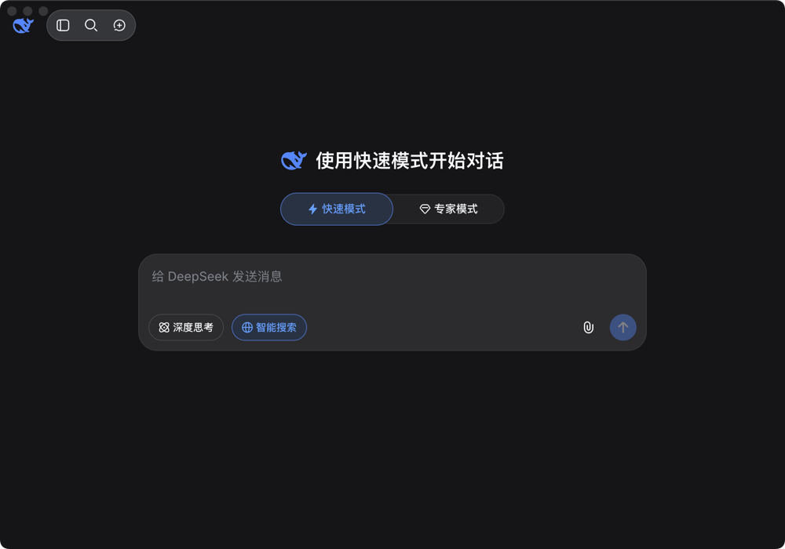

# MineAI Hub

AI 服务聚合桌面应用，一站式访问 DeepSeek、豆包、Kimi、秘塔等主流 AI 对话平台。

## 截图





## 下载

macOS（Apple Silicon / Intel）：

[下载 v1.0.1](https://github.com/welsione/MineAI-Hub/releases/tag/v1.0.1)

## 功能

- **多服务聚合** — 侧边栏一键切换 DeepSeek / 豆包 / Kimi / 秘塔
- **全局快捷键** — Cmd+Shift+Space 唤起 / 隐藏窗口，支持自定义
- **明暗主题** — 跟随系统或手动切换，服务页面同步变色
- **专注模式** — 隐藏侧边栏，左侧悬浮条点击退出
- **服务缓存** — 切换服务不刷新页面，保留对话状态
- **设置面板** — macOS 风格设置页，主题 / 快捷键配置

## 技术栈

- Electron 35 + BrowserView
- 原生 CSS 变量主题系统

## 开发

```bash
npm install
npm run dev
```

## 打包

```bash
npm run release:mac
```

成品在 `release/` 目录，中间产物在 `dist/`。

## 许可

MIT
